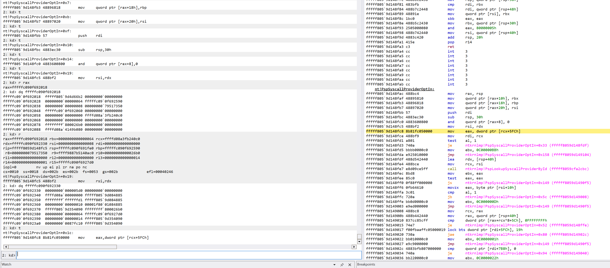
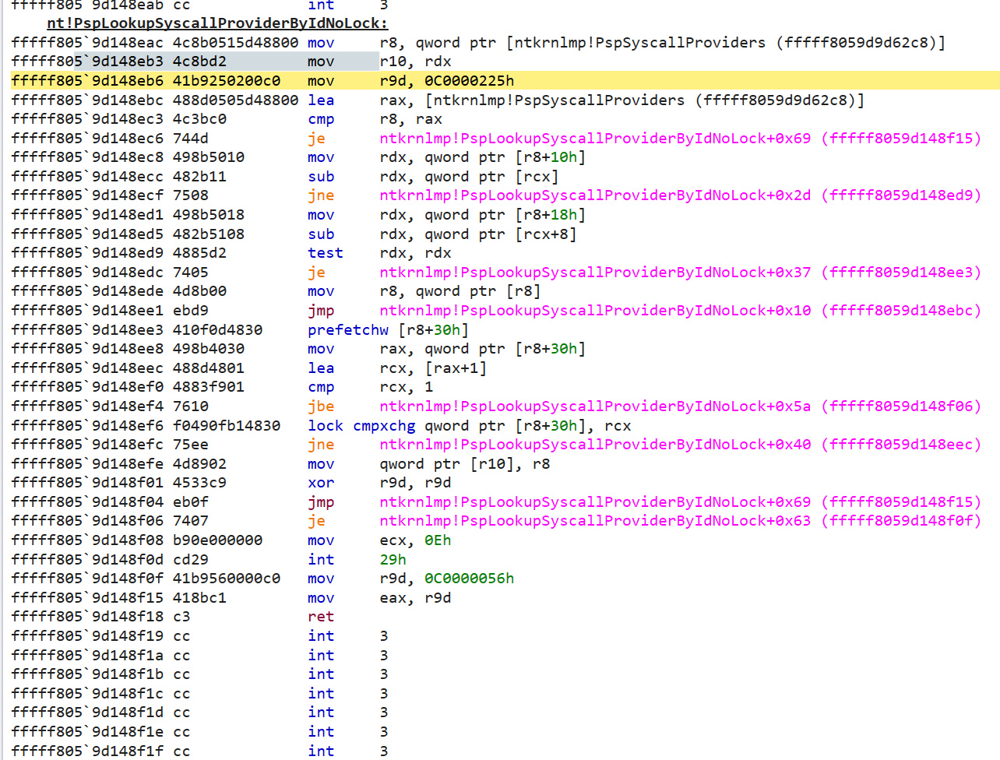
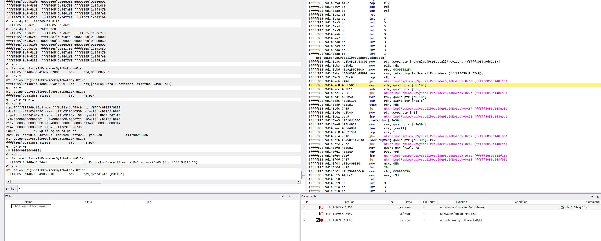

fffffc090f6927d0

[rsp+310h] == (handle) (thread null) 00000000`000005d0 00000000`00000000  
[rsp+320h] == 0    // the last field

fffff805`9d4d66a0 488d942410030000   lea     rdx, [rsp+310h] -> this contains:

00000000`000005d0 00000000`00000000               then the next val is: ffffd08a`00000000

rdx now contains our struct; moved into rsi

nt!PspSyscallProviderOptIn

Now rcx == fffffc090f692330, which * to:

fffffc09`0f692330 | 00000000`000005d0 00000000`00000000
fffffc09`0f692340 | ffffd08a`00000000

Inside of **nt!PspLookupSyscallProviderById**, rsi = fffffc090f692330 = our struct

fffff805`9cfa2d02 f04c0fb135ed4ea300 lock cmpxchg qword ptr [ntkrnlmp!PspSyscallProviderRegistrationLock (fffff8059d9d7bf8)], r14
fffff805`9cfa2d0b 7410               je      ntkrnlmp!PspLookupSyscallProviderById+0x61 (fffff8059cfa2d1d)

going into: 
fffff805`9cfa2d2f e878611a00         call    ntkrnlmp!PspLookupSyscallProviderByIdNoLock (fffff8059d148eac)

RCX = fffffc090f692330 = our struct (See below)

See the error val in here:

modified r8 and it gets us past in **nt!PspLookupSyscallProviderByIdNoLock**:

####################################

Before running:

0: kd> dq nt!PspSyscallProviders L5
fffff803`7b7d62c8  fffff803`7b7d62c8 fffff803`7b7d62c8
fffff803`7b7d62d8  ffffae0d`f7518190 00000000`00000000
fffff803`7b7d62e8  00000000`00000000

bp's addditional: 

- `bp nt!PsRegisterAltSystemCallHandler`
- `bp fffff8037af551a3` (the return)

On first break

0: kd> dq nt!PspSyscallProviders L5
fffff803`7b7d62c8  fffff803`7b7d62c8 fffff803`7b7d62c8
fffff803`7b7d62d8  ffffae0d`f7518190 00000000`00000000
fffff803`7b7d62e8  00000000`00000000

From the application: Syscall handler address: 0xfffff803112ac490

eq nt!PspSyscallProviders+0x10 fffff803112ac490

then theres some subtraction that makes the address of something be fffff803112ab944

## Look at this 

 And it can't be set to 0 because PsAltSystemCallHandlers[0] is already taken by PsPicoAltSystemCallDispatch:

3: kd> dqs nt!PsAltSystemCallHandlers L2
    fffff806`79cfc798  fffff806`795843f0 nt!PsPicoAltSystemCallDispatch
    fffff806`79cfc7a0  00000000`00000000

###########

b4 

nt!DbgBreakPointWithStatus:
fffff802`ceeb9270 cc              int     3
0: kd> dqs nt!PsAltSystemCallHandlers L2
fffff802`cf9c52c0  fffff802`cefa4380 nt!PsPicoAltSystemCallDispatch
fffff802`cf9c52c8  00000000`00000000

0: kd> dqs nt!Ps L5
fffff802`cf9d62c8  fffff802`cf9d62c8 nt!PspSyscallProviders
fffff802`cf9d62d0  fffff802`cf9d62c8 nt!PspSyscallProviders
fffff802`cf9d62d8  ffff8a83`584e9a50
fffff802`cf9d62e0  00000000`00000000
fffff802`cf9d62e8  00000000`00000000

ok so after the registration function finishes, we have set:

1: kd> dqs nt!PsAltSystemCallHandlers L2
fffff802`cf9c52c0  fffff802`cefa4380 nt!PsPicoAltSystemCallDispatch
fffff802`cf9c52c8  fffff802`656cc490 sanctum!DriverEntry+0xd3d0

##########

re

NTSTATUS ObReferenceObjectByHandleWithTag(
  [in]            HANDLE                     Handle,                    process_handle
  [in]            ACCESS_MASK                DesiredAccess,             0x20
  [in, optional]  POBJECT_TYPE               ObjectType,                PsProcessType
  [in]            KPROCESSOR_MODE            AccessMode,                r15
  [in]            ULONG                      Tag,                       last 4 bytes
  [out]           PVOID                      *Object,                   out_param
  [out, optional] POBJECT_HANDLE_INFORMATION HandleInformation          
);

1406dec62
what the hell is this possible == null

PspLookupSyscallProviderByIdNoLock -> 1409b0cdc

want to break on **PsRegisterSyscallProvider** found from:

3: kd> x nt!*PspInsertSyscallProvider*
3: kd> x nt!*SyscallProvider*
fffff802`cf42c934 nt!PspInheritSyscallProvider (void)
fffff802`cf9d7bf8 nt!PspSyscallProviderRegistrationLock = <no type information>
fffff802`cf148b7c nt!PspAttachProcessToSyscallProvider (PspAttachProcessToSyscallProvider)
fffff802`cefa2c28 nt!PspDereferenceSyscallProvider (PspDereferenceSyscallProvider)
fffff802`cefa2db8 nt!PspUnlockSyscallProviderExclusive (PspUnlockSyscallProviderExclusive)
fffff802`cefa2bc4 nt!PspAcquireSyscallProviderRegistrationLockExclusive (PspAcquireSyscallProviderRegistrationLockExclusive)
fffff802`cf4744b0 nt!PsSyscallProviderDispatch (PsSyscallProviderDispatch)
fffff802`cf149124 nt!PspSyscallProviderServiceDispatchGeneric (PspSyscallProviderServiceDispatchGeneric)
fffff802`cf148ccc nt!PspDetachProcessFromSyscallProvider (PspDetachProcessFromSyscallProvider)
fffff802`cf148b40 nt!PsUnregisterSyscallProvider (PsUnregisterSyscallProvider)
fffff802`cefa2d78 nt!PspReleaseSyscallProviderRegistrationLockExclusive (PspReleaseSyscallProviderRegistrationLockExclusive)
fffff802`cf9d7a76 nt!PspSyscallProvidersEnabled = <no type information>
fffff802`cf0e22b0 nt!VslRegisterSyscallProviderServiceTableMetadata (VslRegisterSyscallProviderServiceTableMetadata)
fffff802`cf1488f0 nt!PsQuerySyscallProviderInformation (PsQuerySyscallProviderInformation)
fffff802`cf148eac nt!PspLookupSyscallProviderByIdNoLock (PspLookupSyscallProviderByIdNoLock)
fffff802`cf148950 nt!PsRegisterSyscallProvider (PsRegisterSyscallProvider)
fffff802`cf9d62c8 nt!PspSyscallProviders = <no type information>
fffff802`cf148f20 nt!PspQuerySyscallProviderProcessList (PspQuerySyscallProviderProcessList)
fffff802`cf148fac nt!PspSyscallProviderOptIn (PspSyscallProviderOptIn)
fffff802`cf0cb798 nt!PsRegisterSyscallProviderServiceTableMetadata (PsRegisterSyscallProviderServiceTableMetadata)
fffff802`cf148da8 nt!PspGetNextSyscallProviderProcess (PspGetNextSyscallProviderProcess)
fffff802`cefa2cbc nt!PspLookupSyscallProviderById (PspLookupSyscallProviderById)
fffff802`cefa2c5c nt!PspLockSyscallProviderExclusive (PspLockSyscallProviderExclusive)
fffff802`cf0e2410 nt!VslRevokeSyscallProviderServiceTables (VslRevokeSyscallProviderServiceTables)
fffff802`cf0818d0 nt!PspSyscallProviderServiceDispatch (PspSyscallProviderServiceDispatch)
fffff802`cf5f5950 nt!PsInitializeSyscallProviders (PsInitializeSyscallProviders)
fffff802`cf148c64 nt!PspDestroySyscallProvider (PspDestroySyscallProvider)
fffff802`cea25c08 nt!SystemSyscallProviderGuid = <no type information>

3: kd> x ntkrnlmp!VslVsmEnabled
fffff801`d4bc4a84 nt!VslVsmEnabled = <no type information>

ed nt!PspSyscallProvidersEnabled 1
dw ntkrnlmp!PspSyscallProvidersEnabled L1
eb fffff801`d4bd7a76 01